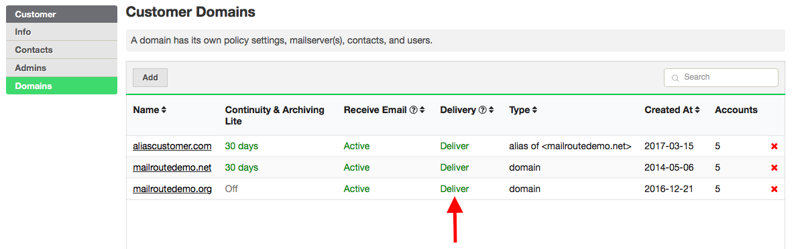
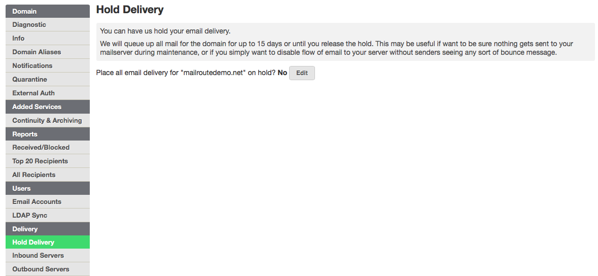

You can put email delivery for a domain on **hold**. We will accept email for
a domain that's on hold, but we won't try to deliver it to your mailserver.
We'll queue it until you release the hold.

Note that we will queue mail regardless of whether you put it on hold or not,
in the event that we cannot reach your mailserver.

The proactive step of placing delivery on hold is useful if you want to pause
delivery while you upgrade a mailserver, you're making changes to your email
accounts list, etc.

You can put email delivery on hold two different ways.

  1. Click on the domain you want to put on hold or click on the **Delivery** column under **Domains**. To resume mail delivery, just click on the word Hold and it will change to Deliver. 

You will then see a prompt asking if you are sure you want to place a hold on
email delivery.

2\. Click on the **Hold Delivery** tab. Then click **Edit,** check the box and
hit **Save**. Be sure to go back and uncheck the box and hit Save to resume
mail delivery.

Enable email delivery hold by clicking the box and hitting Save.

[Start a free 30-day trial today.](http://mailroute.net/signup.html)

Contact [sales@mailroute.net](mailto:sales@mailroute.net) or
[support@mailroute.net](mailto:support@mailroute.net) for more information.

888.485.7726

