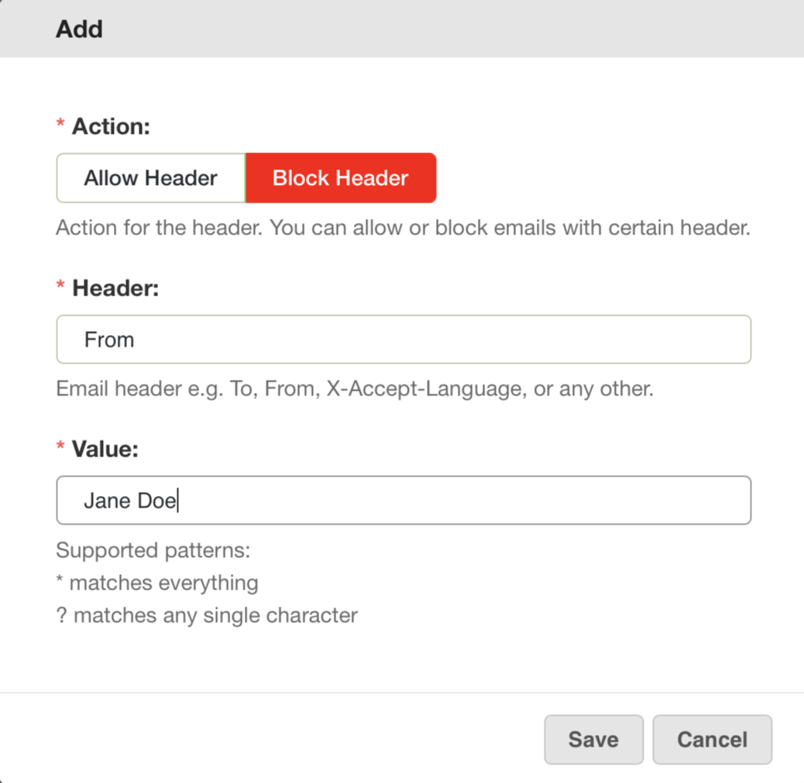
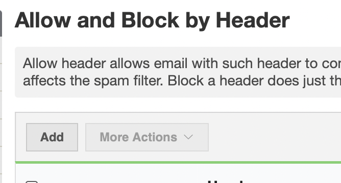
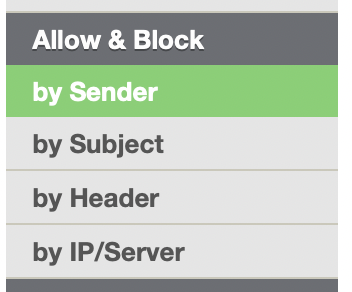

Stop bad actors from targeting individuals in your company from socially-
engineered phishing and spoofing attacks with our custom rules. Emails that
look like they're internal communications from company CEOs, VPs, Executives
names may be spoofed in the From Header to employees in the hopes of extorting
money, asking for bank details, downloading malware, or click on dangerous
links in emails.

Have you seen emails where the From header contains the name of one of your
executives? For example, if your CEO is named "Jane Doe", you may have seen
emails where the From header looks like this:

From: "Jane Doe" <randomaddress@maliciousdomain.com>

When viewed like this, the phishing attempt is obvious. Unfortunately, many
email clients, including those on many smartphones, display only the "Full
Name" by default, so your users may just see that the email came from "Jane
Doe" and not see the rest of the email address.

MailRoute suggests that you consider blocking these messages with our powerful
Anti-Phishing filtering feature. You can block all email from the outside that
contains the full names of employees in the From Header, and send them to
directly to your MailRoute Quarantine.

_Note: Internal email within your company should stay local to your own
mailserver. Email from your CEO to the accounting department should be staying
local and not traveling over the internet and coming in through MailRoute, so
these sorts of blocks should not affect your internal email._

How To Configure Your Custom Anti-Impersonation/Spoofing Filters

1\. Identify the people in your organization that are vulnerable for targeted
attacks. Note their standard email client settings - how do they set the
"From" address in their email. Make a list of different variations of their
name as well. "Jane Doe" may also be "J Doe" or "Janey Doe" or "Janie Doe".
Consider whether blocking those would help protect your users.

2\. Login to your [MailRoute Control Panel](https://admin.mailroute.net) (you
will need to be an Administrator) and go to **Allow & Block** section in the
left-hand menu.

3\. Select by the "by Header" option:

4\. Click the "Add" button to add a new entry:

a. Select "Block Header" for the **Action** to be performed.

b. Enter "From" in the **Header** field

c. Enter the Full Name of the VIP whose name you wish to filter from inbound
email:

for example "Jane Doe"

d. Click **Save**

5\. Repeat Step 4 for each of your users, and for each variation of the user's
name.

For example, for "Jane Doe", you may also wish to add blocks for:

JDoe

JaneDoe

J_Doe

JM Doe

Janey Doe

**Important Note:**

Users you have added to this From header Blocklist may have outside email
addresses that they use. For example, Jane Doe may have an email address at
gmail that they use to send email every once in a while. You may need to enter
those email addresses as a general Whitelist by Sender:

