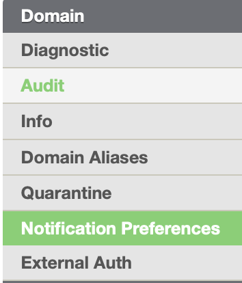

Administrators can control what domain end users can view and can action in
their quarantine reports by customizing quarantine notification emails for
their domain.

Follow the step-by-step instructions on how to enable or disable quarantine
settings.

_*Changes to the Quarantine Notification Email apply to the entire domain_

**To Begin the Customization Process:**

1\. Login to MailRoute Control Panel with your Administrator credentials

2\. In the Domain Detail Page scroll down to Notification Preferences in
Domain tab:

3\. Customizing Quarantine Notification Email

Select which category is visible to users:

**Spam** \- email that is considered spam by content filters. A standard spam
score is 7 unless your settings have been changed

**Virus** \- email has been identified as infected with a virus or malware. By
default, only Admins can release a suspected virus email and users can only
view the email.

**Banned** -emails with banned filetypes are messages that contain various
types of dangerous enclosures. The standard filetypes blocked by this filter
include: .bat, .cmd, .com, .cpl, .dll, .exe, .pif, .scr, .js, .jar and .vbs.
These restrictions apply to files embedded inside other files, like zip or tar
files too.

**Blocked** \- emails that have been blocked by a user or in the domain-wide
settings are listed here.

4\. Customizing Actions in the Quarantine Notification

Allow Action - Enable or disable users being able to 'Allow' a sending
address.

Recover Action - Enable or disable users being able to 'Recover' an email from
quarantine.

Block Action - Enable or disable users being able to 'Block' an email from
quarantine.

5\. Customizing Quarantine Notification Email Content

If you wish to customize the content in the quarantine notification email you
can use our template provided in the control panel.

If you're happy with the default text/content don't change the template and
leave this area blank.

Use the notification template to create quarantine notification content:

Subject - Fill in custom subject for quarantine notification emails or leave
empty to use default one (Quarantine Notification)

You can customize content of quarantine notification emails with the following
placeholders:

{{ email }} - user email

{{ date }} - date of notification

{{ service_name }} - name for your filtering service

{{ messages_count }} - how many new messages in quarantine

{{ login_link }} - link to the login page

{{ admin_notice }} - notification for admins

{{ user_notice }} - notification for users

**Dear {{ email }}:**

**  You have {{ messages_count }} NEW quarantined messages as of {{ date
}}**

**  The following is a list of email messages that have been blocked by the
{{ service_name }} email filtering service.**

**  To recover a message to your inbox, allow the sender, or view the
message, visit the corresponding URL. You will be taken right to the
Quarantine.**

**  Messages will be automatically removed from the SpamStore after 15
days.**

**  {{ admin_notice }}**

**  {{ user_notice }}**

**6\. Select Save to save your edits/customizations.**

**For more information on quarantine notifications please see our article
here:<https://support.mailroute.net/hc/en-us/articles/224061408-Quarantine-
Notifications>**

