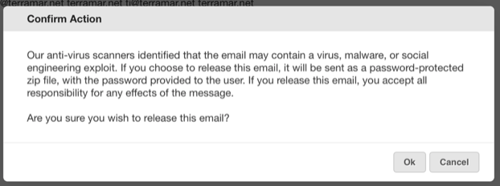
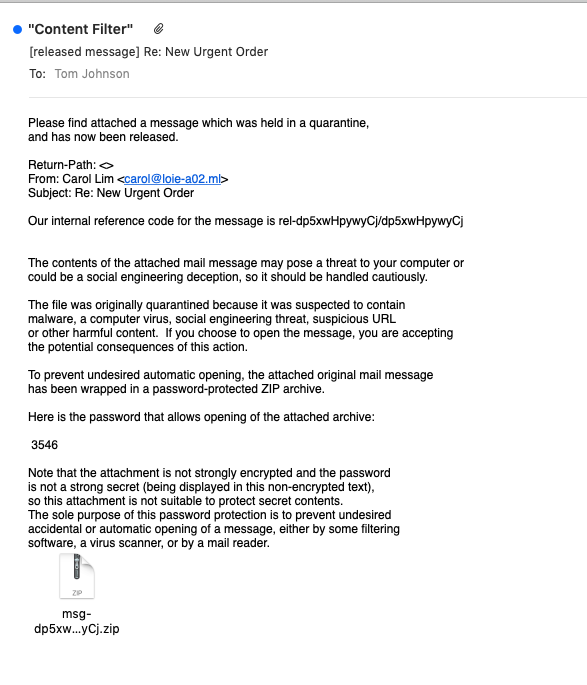

Occasionally there are emails in the virus tab of the quarantine that users
want released, even though our AV filters have identified them as potentially
infected with malware.

Sometimes they are indeed infected and sometimes it's because of an overly
ambitious reach by one of our AV providers.

In cases where Administrators are confident the emails are safe and from
known, trusted senders, we have created a feature that allows Administrators
(and _only_ Administrators) to release an email from the virus tab of the
quarantine.

To begin the virus release the email must be selected from the virus tab of
the quarantine. When release is selected a warning pops up:

If you select Ok then the virus email is sent as in a password-protected zip
file as an attachment in an email that explains like this:

