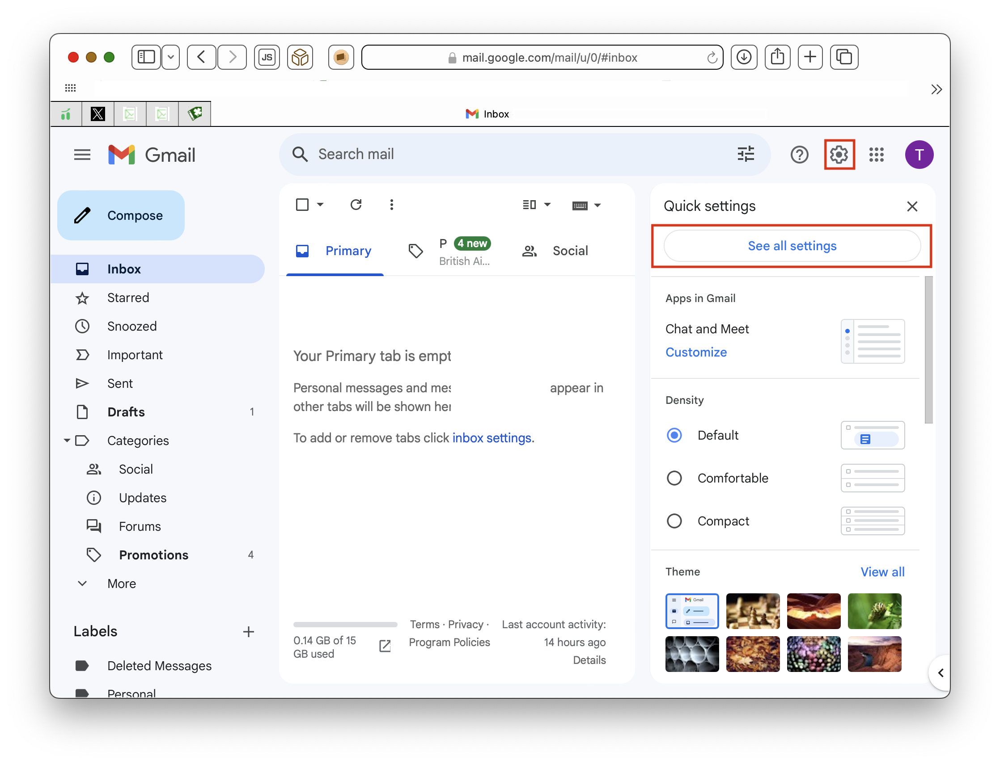
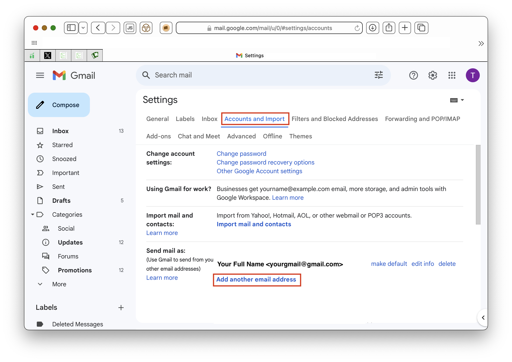
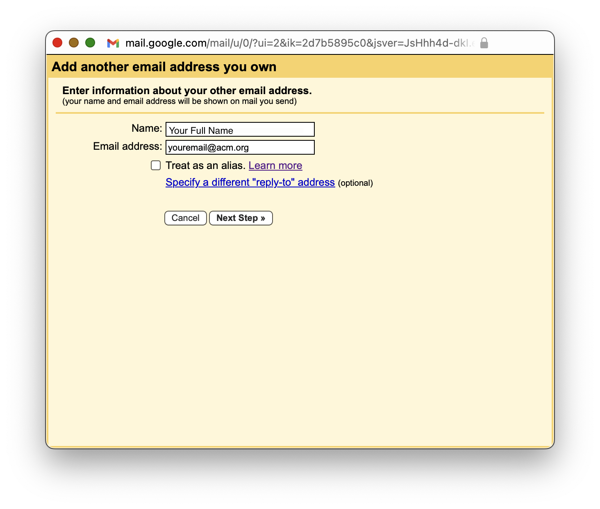
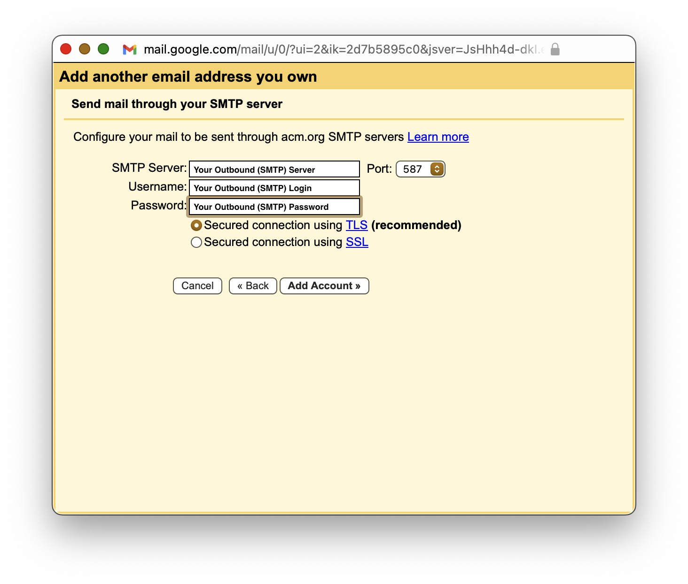
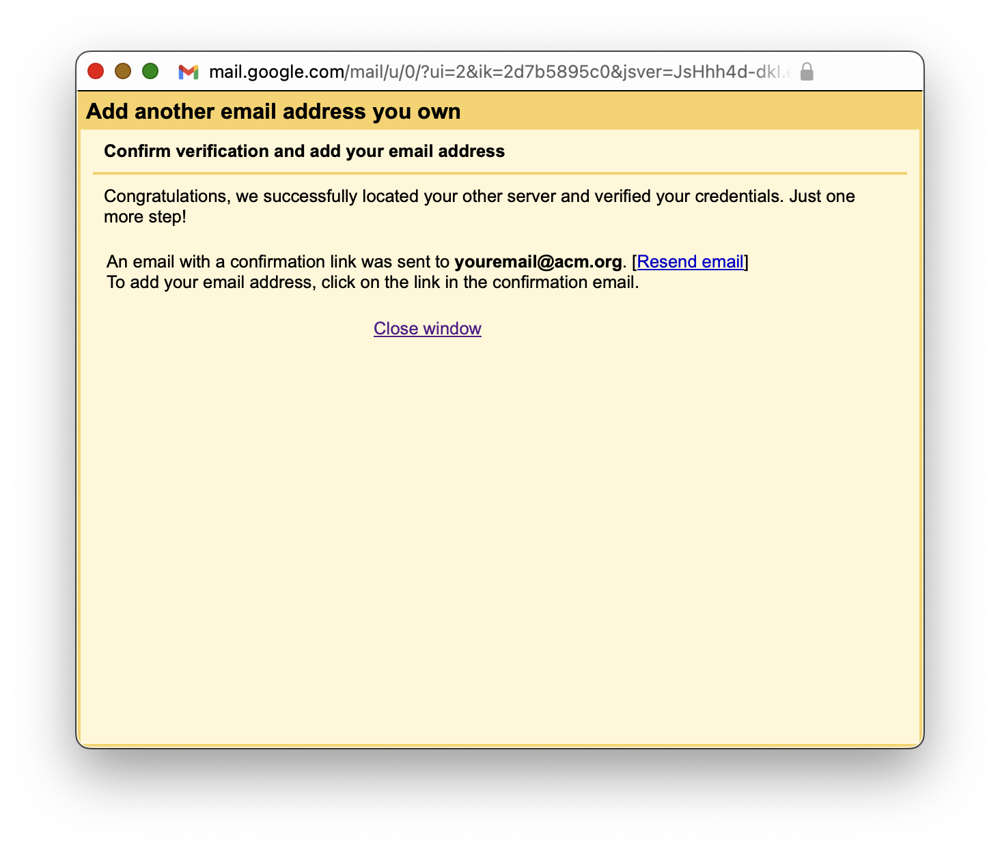
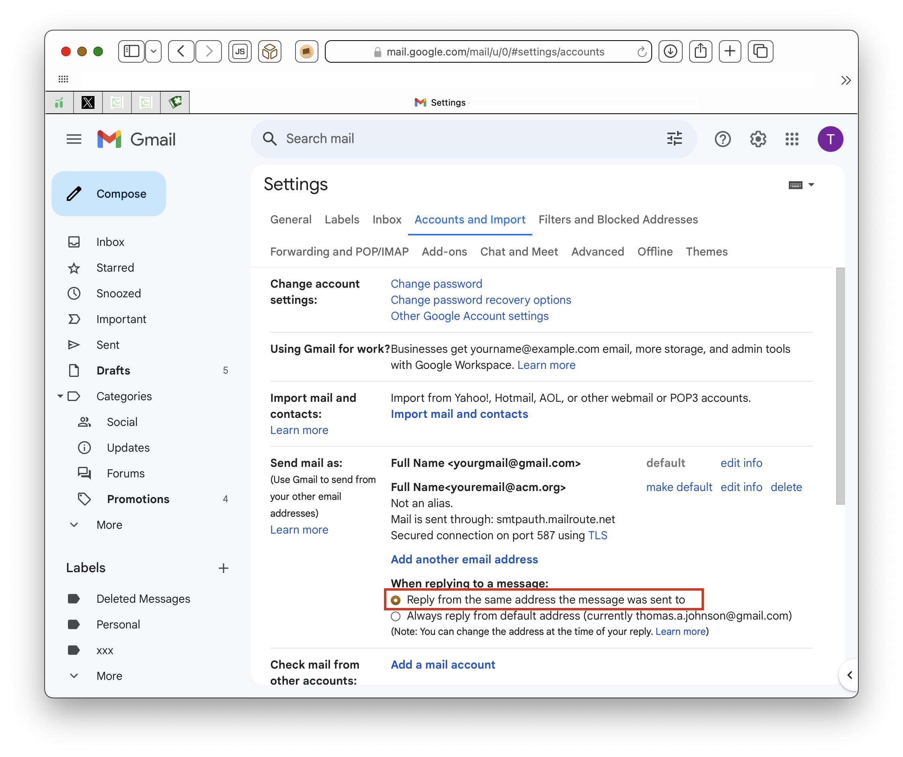
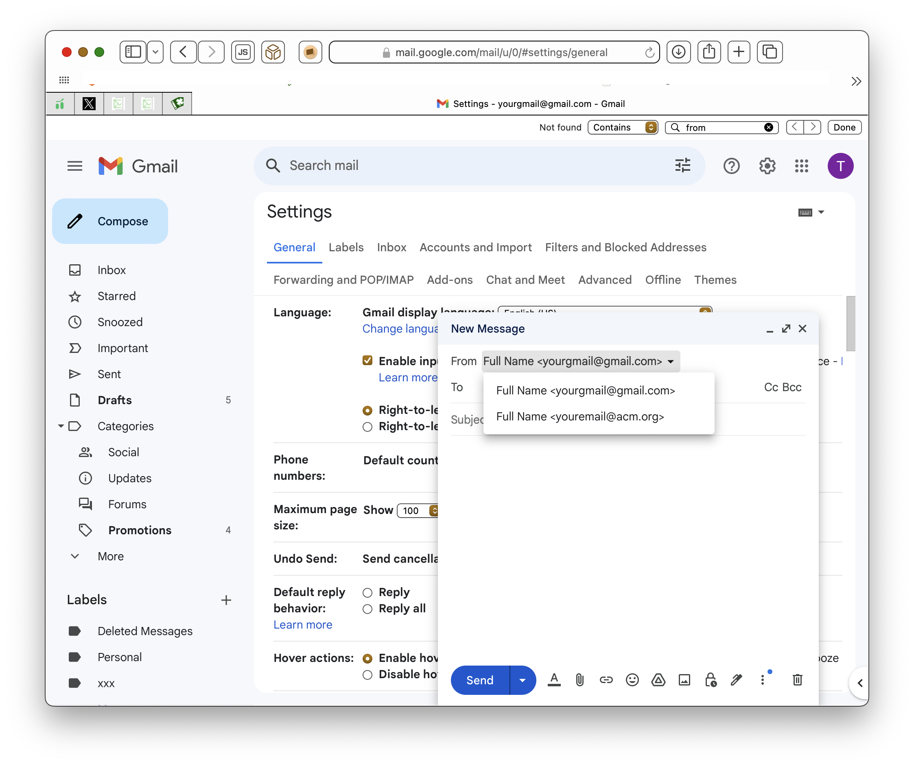

Gmail actually makes it simple to send outbound mail from your MailRoute SMTP
Auth account! You simply configure another outbound email address and
associated server, and the gmail webclient uses it whenever you're sending
email from that account.  
  

# **TLDR; (Too Long, Didn't Read)**

Gather the info from our Control Panel by clicking the **SMTP Auth Relay** tab
on the left menu. You'll have to click the eye
icon to view your passwords. If you don't
have a local password set up, you'll be asked to create one. The **Inbound
(IMAP)** and **Outbound (SMTP)** servers may have different logins and will
have different passwords. Go into your Gmail Settings -> See All Settings ->
Accounts and Import, and add an address in the Send mail as section.

When you send email, click the **From** address to choose your new account for
sending email. It'll pass SPF, DKIM, DMARC checks. Congratulations!

# **Long Version**

# Gather the info you need to configure your email client

To configure your email client to use the MailRoute SMTP Auth Relay service
for outbound email relay, you will need to gather some info from the MailRoute
Control Panel and then configure your email client.

  1. Login to admin.mailroute.net and click the My Settings link at the top of the page.  
  

  2. Click the SMTP Auth Relay tab in the Settings menu on the left side of the page.   
  
  
  

  3. Gather your info! You can click the copy icon  to copy the values of any field.  
  
For the Gmail webmail interface, you will only need the info in the **Outbound
(SMTP) Server** configuration.  
  
  
 **Outbound (SMTP) Server Password:** Click the eye icon
 to display your password. Accept the
Terms of Service:  
  
  
  
By the way, you can generate a new password for your **Outbound (SMTP)
Server** at any time.

  
**Configure your email client**

  1. Go into Gmail on a web browser. Choose the **Setting** icon at the top, and then click on **See all settings** :  
  
 ****  
  

  2. Choose **Accounts and Import** , and then click **Add another email address**... from the **Send mail as** section  
  
  

  3. Enter your **Full name** and your new **Outbound SMTP Auth email address**.  
  
If you use the Gmail webmail client as the primary client for your email
address, you may want to select **Treat as an alias.** If, instead, you just
treat your account as a way to send email on that account's behalf, then do
not select **Treat as an alias**  
  

NOTE: **Treat as Alias** doesn't affect the reception of the message, nor the  
sending of the message  
  
It does affect how gmail views the message, and how it categorizes it. Its  
your choice which way you prefer.  
  
 **Treat as alias** applies to addresses you use for sending mail, but
addresses  
you use for sending email fall into at least two classes, "my addresses"  
and "other addresses I am allowed to use" (ie, if you are sending email  
on another account's behalf). "Treat as alias" is used to identify  
"my addresses".  
  
The primary use case for "treat as alias" is for external addresses you  
have delivered to your Gmail account, so you are using Gmail as the  
primary client for the address.  
  
So it all depends on how you want to use gmail for this account.  
It's up to you.  
  
To summarize:  
\- External addresses that are not aliases are treated as someone else's
address.  
\- If you send a message to an external address that is not an alias,  
it will not show in the Inbox.  
\- If you receive a message from an external address that is not an alias,  
it will not show in Sent.  
\- When you reply to a message from an external address that is not an  
alias, it is a normal reply and will be addressed to the original sender  
\- When you search for from:me or to:me, it will not match external  
addresses that are not aliases.

  
Click **Next Step >**  

  4. Here's where you start filling in the info you gathered from our Control Panel. Enter the following:  
  
**SMTP Server** : <Your Outbound (SMTP) Server>  
**Port:** <Your Outbound (SMTP) Port>  
**Username** : <Your Outbound (SMTP) Login>  
**Password** : <Your Outbound (SMTP) Login>  
  
Make sure **Secured connection using TLS (recommended)** is selected.  
  
Then click **Add Account >**  

  5. You'll see a verification window pop up. Google will send an email to your address with a confirmation link. Go into your email client, find that email and click on the confirmation link.  

  6. Your Gmail settings will now show a verified new address. You may want to choose the option to **Reply from the same address the message was sent to:**  

## Using your new account to send email

When you compose a new email, you can choose to send it from your new account.
Just click on the address in the **From** header and choose the account from
which you would like to send the message.  
  
  
  
That's all there is to it! Have fun!

