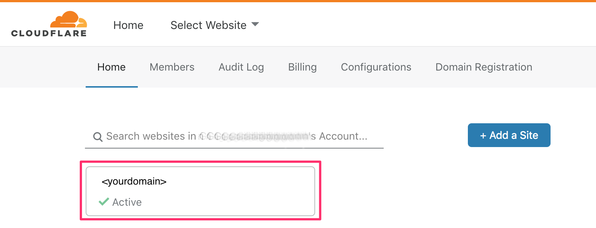
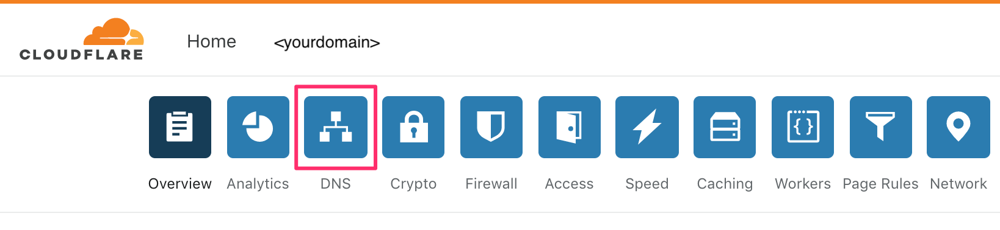
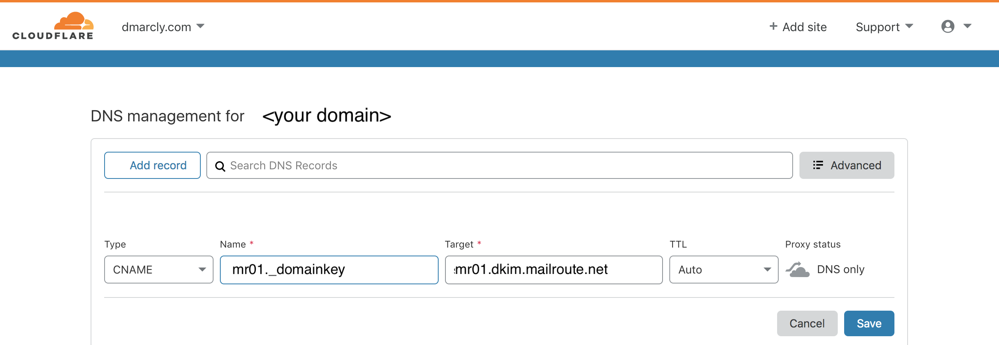

##### 1\. Login to CloudFlare

Navigate to [cloudflare.com](https://cloudflare.com/), enter your credentials
to login.

##### 2\. Locate your domain

On the CloudFlare dashboard's home page, find your domain you want to add the
DKIM record to, then click.

##### 3\. Manage DNS

Select the DNS button.

##### 4\. Create the record entry

Enter the settings for your DKIM record:

In the Type drop down menu select CNAME

In the 'Name' tab add: mr01._domainkey

In the Target tab add: mr01.dkim.mailroute.net

Set TTL to auto

Click the Save button and your records are now added!

Repeat Step 4 for mr02._domainkey and mr03._domainkey

If you have any questions regarding the instructions please contact
[support@mailroute.net](mailto:support@mailroute.net)

