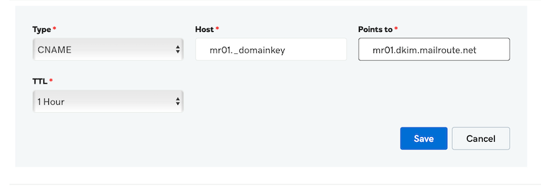
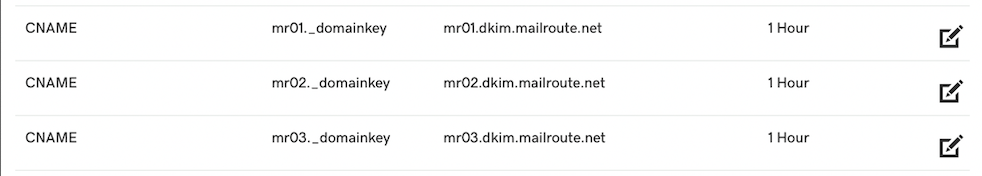

Login to your GoDaddy account

1\. Go to My Products>Domains>DNS.

2\. Select Add

3\. Your page will look like this (below)

Select:

Type: CName

Host: mr01._domainkey

Points to: mr01.dkim.mailroute.net

TTL: 1 Hour

Click Save.

Repeat steps for mr02._domainkey and mr03_domainkey. Your CName records should
look like this when finished.

