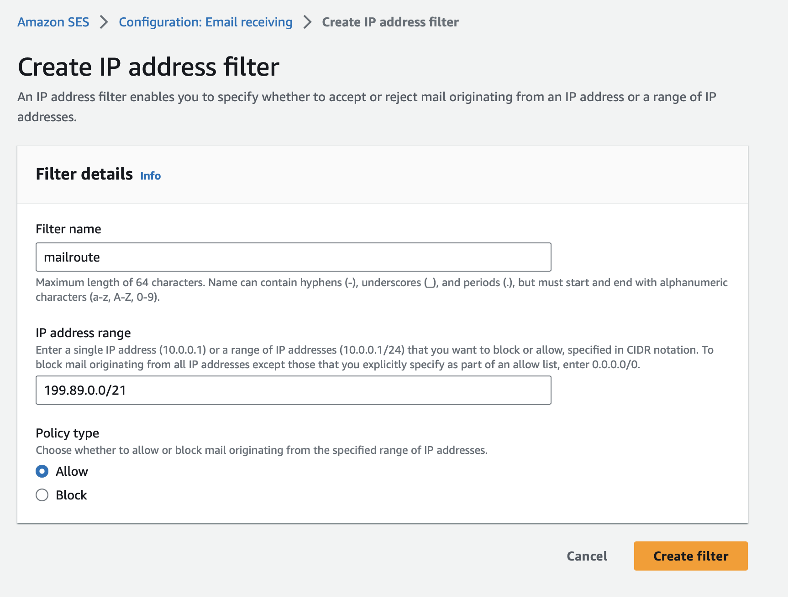
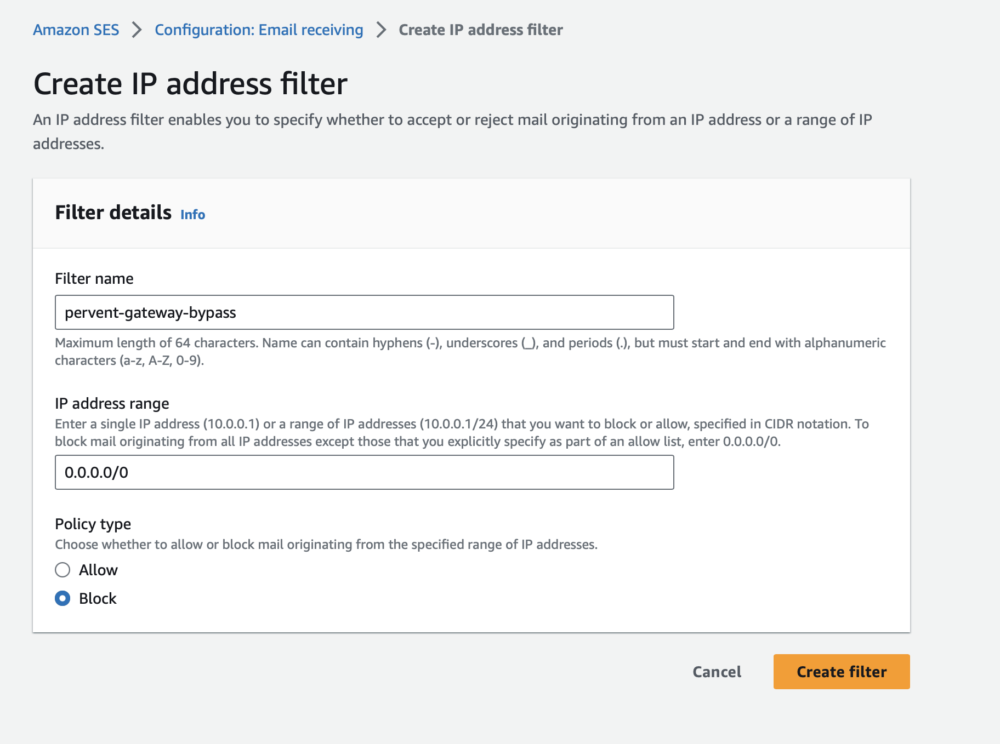

To configure Amazon WorkMail for the MailRoute Inbound Filtering Service,
there are two things you need to do - prevent WorkMail from blocking mail that
violates their own DMARC checks, and allowing all mail traffic from MailRoute
while blocking email that comes from other servers (ie "locking down your
server").

These are the steps from this Amazon article:

### <https://aws.amazon.com/blogs/security/how-to-configure-an-incoming-email-
security-gateway-with-amazon-workmail/>

###

Disabling Additional WorkMail DMARC Checks:

From the [WorkMail console](https://console.aws.amazon.com/workmail/v2/home),
select your organization, navigate to Organization settings, and select
Advanced. Edit the Inbound DMARC Settings and set Enforcement enabled to Off.
This ensures that WorkMail does not re-evaluate DMARC.

Locking Down Your Server:

1\. From the [Amazon SES console](https://console.aws.amazon.com/sesv2/home),
navigate to Email receiving and [create IP address
filters](https://docs.aws.amazon.com/ses/latest/DeveloperGuide/receiving-
email-ip-filters.html) to allow the IP address or IP address range of the
gateway(s).

2\. Add another rule to block 0.0.0.0/0. This prevents malicious actors from
bypassing your email security gateway

This should do it! Now Amazon WorkMail will not perform additional DMARC
checks on incoming email, and it will allow mail to come in from MailRoute and
block other servers trying to send email directly to your WorkMail servers.

