Configuring Microsoft Office 365 for MailRoute takes a few steps. But it's
important that they be done in order. This article makes it look like it's a
lot, but we've tried to be very complete and show you each and every step
along the way. It's not really that difficult.

The first step is to configure MailRoute for your inbound email flow. If
you're a new customer, we may have already done this for you. If you are
changing from another service or an in-house server, you may need to do this
yourself (or ask us to help!)

Then we will set up Transports to handle inbound and outbound email flow, and
a rule that prevents anyone from bypassing MailRoute and sending email
directly to Microsoft.

Microsoft talks about some of this stuff in their article [Managing mail flow
using a third-party cloud service with Exchange
Online](https://learn.microsoft.com/en-us/exchange/mail-flow-best-
practices/manage-mail-flow-using-third-party-cloud)

We're going to do these things in order:

  1. Configure MailRoute with your **Inbound Email Server**
  2. Change your MX record to **mail.mailroute.net**
  3. Add your **SPF, DKIM, DMARC, and ADSP** records to your DNS server
  4. Configure an **Inbound Transport** in Exchange online to allow Office 365 to identify that your mail is coming from a trusted partner who is doing email filtering for you
  5. Configure an **Outbound Transport** to tell Office 365 to send your outbound mail out through MailRoute
  6. Configure **Advanced Filtering for Connectors in Exchange Online** to improve your filtering and reduce false-positives on the Microsoft side

# Step 1. (Which we may have already done for you!) - Configure Inbound Email
Server in MailRoute Control Panel

  * Locate your Office 365 mailserver hostname in the Microsoft 365 Admin Center: <https://admin.microsoft.com/#/Domains>
    * Select your domain, and then click **DNS records**. You'll find your inbound Office 365 mailserver listed in the **MX** record under **Microsoft Exchange**. It will look something like this: **example-com02c.mail.protection.outlook.com  
  
**

    * Visit the MailRoute Admin center at <https://admin.mailroute.net,> and select **Domains** at the top, and then click on your domain in the list
    * 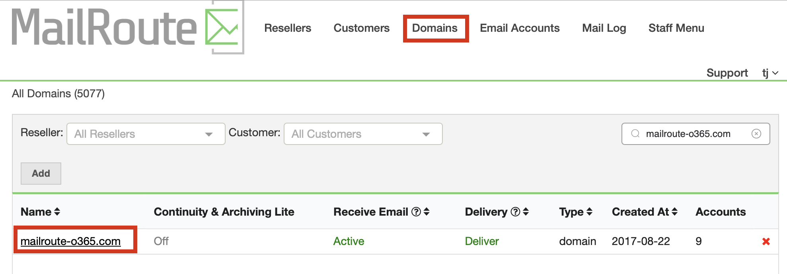
    *   
  

    * Then Choose **Inbound Servers** from the menu at the left, and then click the **Add** button:  
  
  

    * Enter in the Office 365 Mailserver, and set the priority to **10** , and click **Save** :  
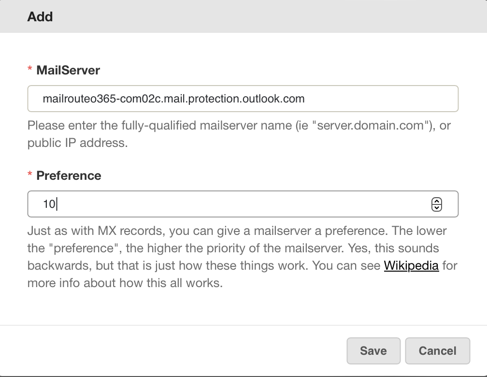  
  

    * Set your **Server Type** by clicking the edit button, and then setting the **Type** to **Office 365** and then clicking **Save.**  

**Note:** MailRoute will automatically recognize that you are relaying email
out from Microsoft, so there is no need to set up an Outbound server in the
MailRoute Control Panel for your outbound mail.

  
  
  
  

# Step 2. Change your MX Record to **mail.mailroute.net**

This will start the flow of email through MailRoute!

We have articles on how to do this for many common DNS providers at
<https://support.mailroute.net/hc/en-us/sections/205311968-Changing-MX-
Records>

  
  

# Step 3. Add SPF, DKIM, DMARC, and ADSP records

To properly protect your outbound mail, add your SPF, DKIM, DMARC, and ADSP
records while you're in there changing your MX record.

We have a primer on what all these are for, if you're interested here:
<https://support.mailroute.net/hc/en-us/articles/360061128614-Email-
Authentication-An-Explanation-and-Exploration>

We have a Knowledge Base articles for each of these:

  * <https://support.mailroute.net/hc/en-us/articles/360021568194-Setting-Your-SPF>
  * <https://support.mailroute.net/hc/en-us/articles/115009100687-Implementing-DKIM>
  * <https://support.mailroute.net/hc/en-us/articles/360062946093-Implementing-DMARC-for-the-MailRoute-Outbound-SmartHost-Service>

##  
  

# Step 4. Configure Inbound Transport

Microsoft uses an inbound **Transport** to identify email that comes in via
MailRoute to prevent false-positives from their own email filtering.

  * Visit <https://admin.exchange.microsoft.com/#/connectors> to manage your connectors.
  * Click **Add a connector**  
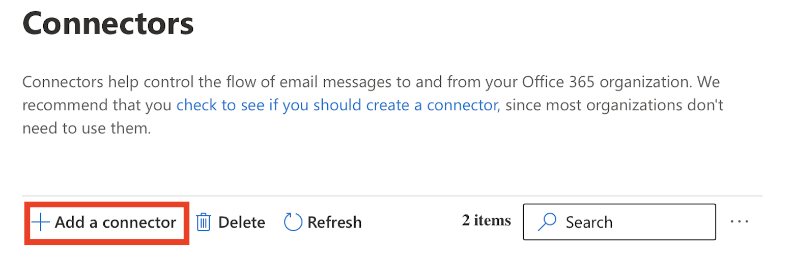  
  

  * Choose **Partner organization** and click **Next:  
**  
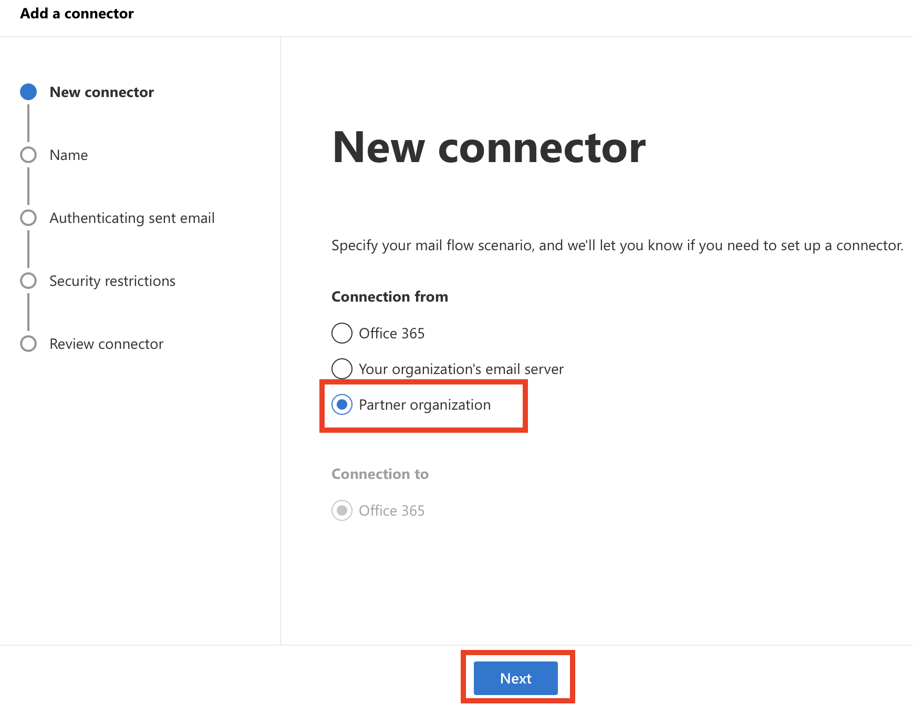

  * Give your connector a name like **MailRoute Inbound** , be sure **Turn it on** is selected, and then click **Next:**  
  
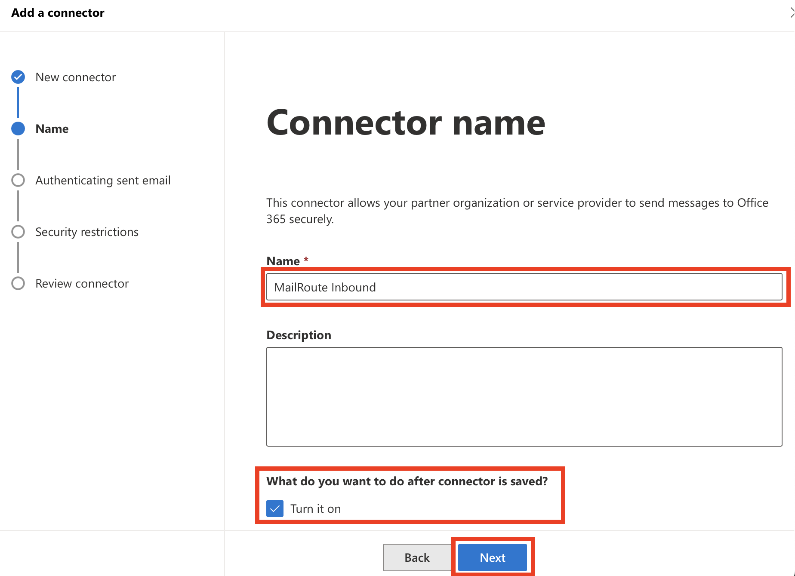  
  

  * In **Authenticating sent email** , choose the option **By verifying that the sender domain matches one of the following domains** , enter ***.mailroute.net** and click the **+** (plus) icon to add this sender domain. After it's added, click **Next:  
  
**

  * In **Security restrictions** , choose the checkboxes **Reject email messages if they aren't sent over TLS** and **And require that the subject name on the certificate that the partner uses to authenticate with Office 365 matches this domain name** and enter ***.mailroute.net** into the text field, and then click **Next:  
  
** **  
  
**

  * In **Review connector** , verify that everything looks good, and then click **Create connector** :  
  

  
  
  
  

# Step 5. Configure Outbound Transport

Microsoft uses an outbound **Transport** to identify route outbound email out
through MailRoute, so that we can improve our filtering accuracy and give your
domain even more protection.

  * If you're not still there, visit <https://admin.exchange.microsoft.com/#/connectors> to manage your connectors.
  * Click **Add a connector**  
  
  

  * In the **New connector** window, choose **Connection from Office 365** and **Connection to Partner organization** , and click **Next** :  
  
  
  

  * Give your connector a name like **MailRoute Outbound** , be sure **Turn it on** is selected, and then click **Next:**  
  
  
  

  * In **Use of connector** , choose **Only when email messages are sent to these domains.** Then enter ***** in the text field and click the **+** (plus) icon to add this sender domain: **  
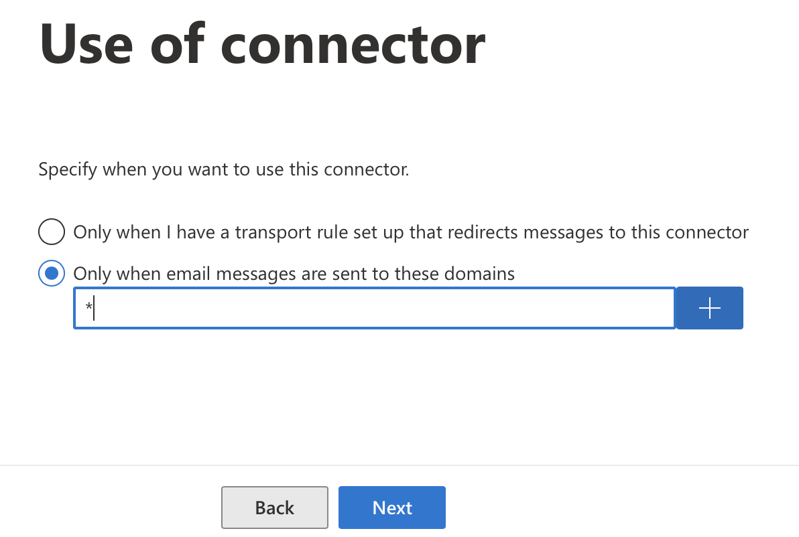  
  
**

  * After it's added, click **Next:  
  
  
  
**

  * On the **Routing** window, choose **Route email through these smart hosts** , enter **outbound.mailroute.net** into the text field and click the **+** (plus) icon to add this SmartHost:  
  
  
  
  
  

  * Now that it's been added, click **Next** :  
  

  * Under **Security restrictions** , choose **Always use Transport Layer Security...,** and then **Issued by a trusted certificate authority (CA)** and **Add the subject name or subject alternative name (SAN) matches the domain name** and enter ***.mailroute.net** into the text field, and click **Next:**  
  
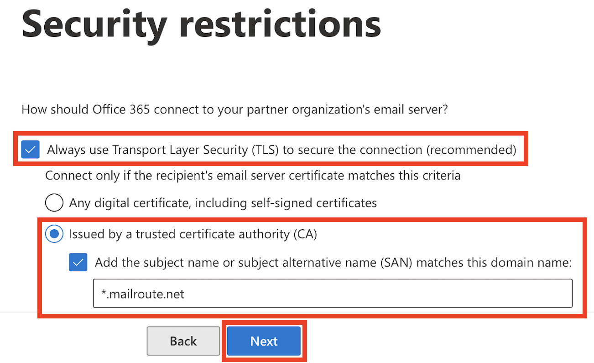  
  

  * in **Validation email** , enter an email address that is outside your own domain for testing. You can use the same one as we do here, if you would like ([test@mailroute.net](mailto:test@mailroute.net)). Enter the email address into the text field, and then click **+** (the plus symbol) to add the address:  
  
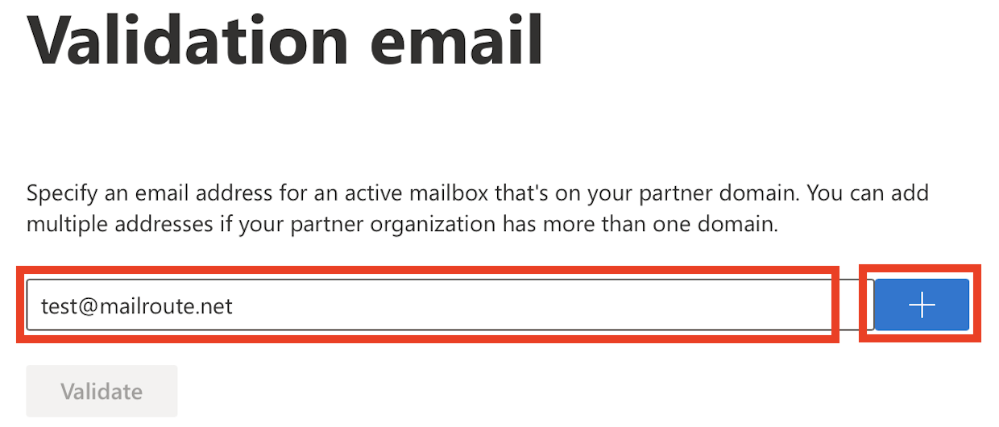  
  
  

  * Then click **Validate** and wait a bit for the test to run.  
  
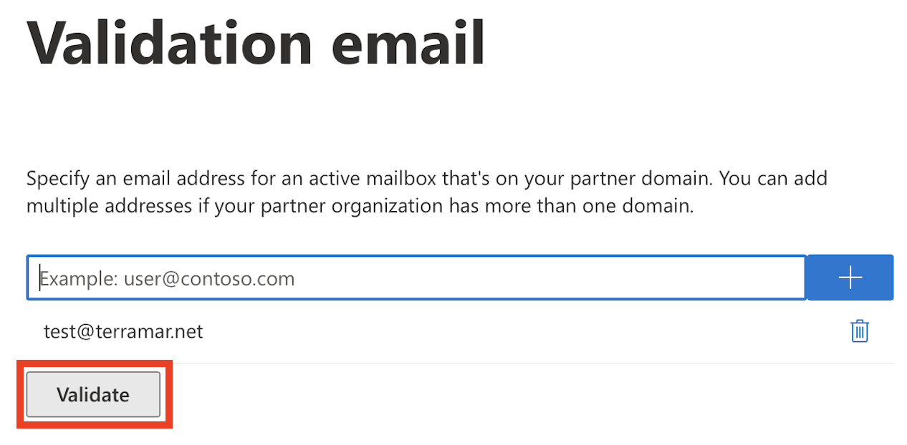  
  

  * Once it's done, and it shows that it's successful, click **Next** :  
  

  * In **Review connector,** make sure it all looks good, and hit **Create connector,** and then press **Next** to finish this up! **  
  
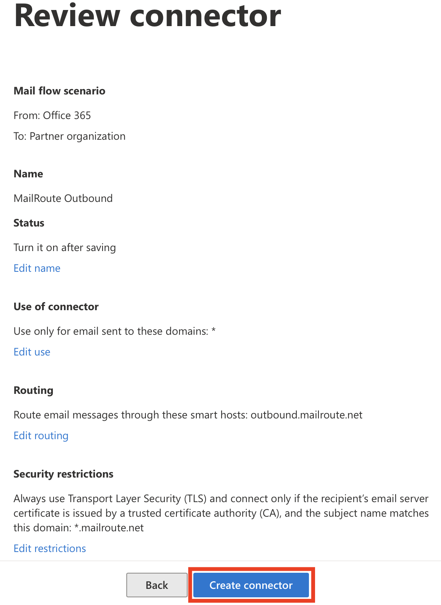  
**

# Step 6. Configure Advanced Filtering for Connectors in Exchange Online

This will reduce false-positives on Microsoft's side and improve filtering
effectiveness. It also prevents people from bypassing MailRoute and sending
email directly to you without filtering.

Microsoft has an article explaining how it all works at
<https://learn.microsoft.com/en-us/exchange/mail-flow-best-practices/use-
connectors-to-configure-mail-flow/enhanced-filtering-for-connectors#what-
happens-when-you-enable-enhanced-filtering-for-connectors>

  * Jump right to the configuration page at <https://security.microsoft.com/skiplisting>
  * Click on your **MailRoute Inbound** connector  
  

  * Choose **Skip these IP addresses**... **,** enter **199.89.0.0/21** into the text area, and then choose **Apply to the entire organization** , and click **Save:**  
  
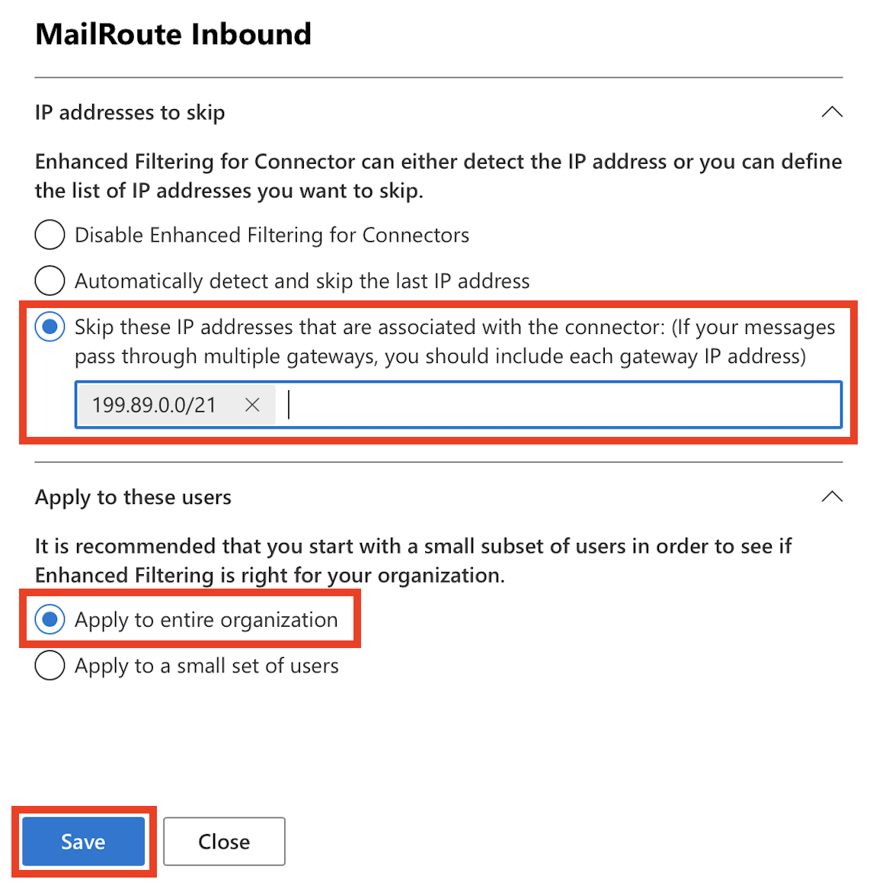  
  

And you're done!

[Start a free 30-day trial today.](http://mailroute.net/signup.html)

Contact [sales@mailroute.net](mailto:sales@mailroute.net) or
[support@mailroute.net](mailto:support@mailroute.net) for more information.

888.485.7726

