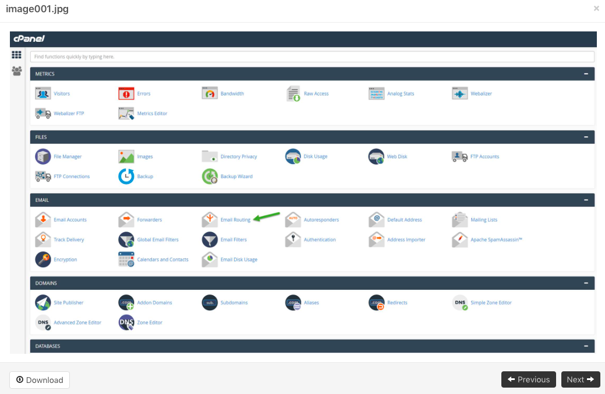
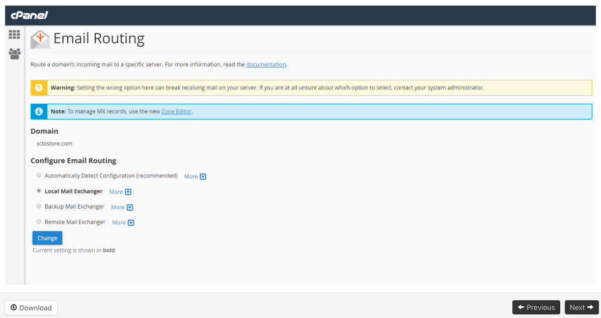

## MX Record Configuration: cPanel

Many different hosts use cPanel as their control panel. Here are some generic
instructions that should apply to all (or at least most) of them.

  1. Log in to your cPanel account.
  2. In the **Mail** section, click **MX Entry**.
  3. If you have more than one domain, select the domain you’re using with MailRoute - look for this under the **Domain** heading.
  4. *Under **Email Routing** , select **Local Mail Exchanger**.
  5. Click the **Change** button.
  6. In the **Add New Record** section, create an MX record for MailRoute: 
    * Priority: **1**
    * Destination: **mail.mailroute.net**
  7. Under **MX Records** , note any old MX records, in case you need them later.
  8. Under **MX Records** , delete any original MX records.

***PLEASE NOTE:** Be sure to select **Local Mail Exchanger** (do not select
Remote or Auto/Auto-Detect). Selecting Remote or Auto/Auto-Detect will
generate a SMTP Authentication error, in the case of Auto/Auto-Detect some
mail will come through while some will produce the SMTP Authentication error.

Selecting **Local Mail Exchanger** will resolve these issues. It is best to
select **Local Mail Exchanger** the first time to minimize the delay in the
record update.

*****Added Note:** The instructions above are generic for different cpanel
environments. You may have a different order to the steps above. It is
important to make sure that **Local Mail Exchanger** is selected and sticking.
You may need to select that first, then update your mx records or visa versa.
You may also need to log out, log back in and double-check that **Local** is
still selected.

[Click here to link to cPanel
documentation.](https://documentation.cpanel.net/display/ALD/MX+Entry)

NOTE:

On some cPanel accounts, this is the screen you will see:

Choose Email Routing:

Click Next. When you see this screen, choose Local Mail Exchanger. Click
Change.

*****Added Note:** The instructions above are generic for different cpanel
environments. You may have a different order to the steps above. It is
important to make sure that **Local Mail Exchanger** is selected and sticking.
You may need to select that first, then update your mx records or visa versa.
You may also need to log out, log back in and double-check that **Local** is
still selected.

[Start a a free 30-day trial today.](http://mailroute.net/signup.html)

Contact [sales@mailroute.net](mailto:sales@mailroute.net) or
[support@mailroute.net](mailto:support@mailroute.net) for more information.

[888.485.7726](tel:888.485.7726)

