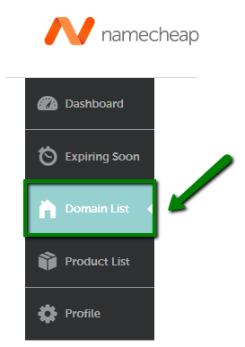
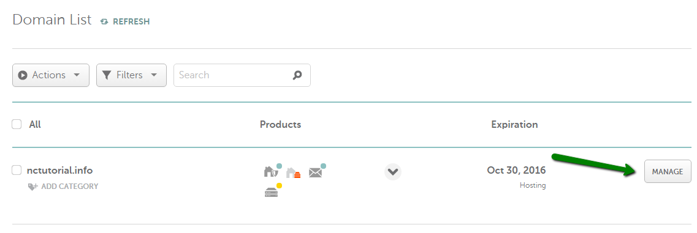
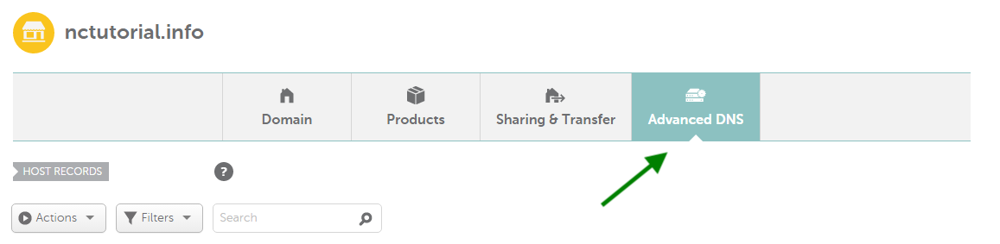
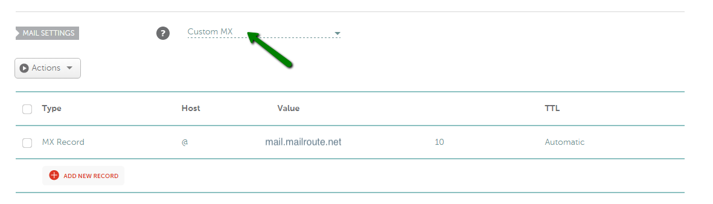

## MX Record Configuration: Namecheap.com

1\. Sign into your
**[Namecheap.com](https://www.namecheap.com/?gclid=CjwKEAjw6_q5BRCOp-Hj-
IfHwncSJABMtDaiBxJzvzjkTRGzPfFZh1fN0KOsK1hN6XZA3F8nyEiI9xoCTMHw_wcB) account**
in the top left corner of the page.

2\. Select **Domain List** in the left sidebar.

3\. Click **Manage** next to the domain name you wish to set DNS records for.

4\. Navigate to the **Advanced DNS** tab.

**** NOTE:** Before setting up your mail service, be sure that there is no
CNAME record created for a bare domain, (e.g., yourdomain.tld) in the **Host
records** section, or email will not work correctly. CNAME has the highest
priority and prevails over all the other records for the host name, including
MX Records which are responsible for mail delivery.

5\. Go to the **Mail Settings** section.

6\. Select **Custom MX** from drop-down menu next to **Mail Settings**
section.

7\. Add the following MX Record:

  * Type: MX Record
  * Host: “ **@** “
  * Value (MailServer): **_mail.mailroute.net_**
  * MX Pref: **10**

8\. Once all necessary settings are selected, be sure to **save changes**.

[Click here to link to NameCheap.com
documentation.](https://www.namecheap.com/support/knowledgebase/article.aspx/322/2237/how-
can-i-set-up-mx-records-required-for-mail-service)

[Start a free 30-day trial today.](http://mailroute.net/signup.html)

Contact [sales@mailroute.net](mailto:sales@mailroute.net) or
[support@mailroute.net](mailto:support@mailroute.net) for more information.

888.485.7726

