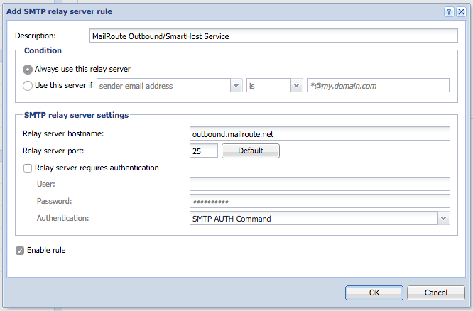

  1. Make sure you've signed up with MailRoute for Outbound Services! This optional service has to be configured by us first or we won't accept any email from your mailserver.
  2. Login to your Kerio Connect admin interface.
  3. Expand **Configuration** , and click on **SMTP Server** , and then the **SMTP Delivery** tab.
  4. Click **Add.**
  5. Type a description for the server.
  6. To use only a single SMTP server to send messages, select **Always use this relay server.**
  7. Select the **use relay SMTP server** radio button.
  8. Define a rule for the sender or recipient. Check **Enable Rule** box. 
  9. Relay server hostname: **outbound.mailroute.net.**
  10. Relay server port: **25**
  11. Be sure **Relay server requires authentication** is NOT checked.
  12. Click **OK**.
  13. Click **Apply.**

  1. Check the **Use SSL/TLS if supported by remote SMTP server** checkbox.

Please see the instructions here for SSL/TLS:
http://kb.kerio.com/product/kerio-connect/server-
configuration/services/configuring-the-smtp-server-1167.html

The changes you've made should take effect without having to restart any
services.

Please feel free to contact us at
[support@mailroute.net](mailto:support@mailroute.net) if you have any
questions.

[Start a free 30-day trial today.](http://mailroute.net/signup.html)

Contact [sales@mailroute.net](mailto:sales@mailroute.net) or
[support@mailroute.net](mailto:support@mailroute.net) for more information.

[888.485.7726](tel:888.485.7726)

