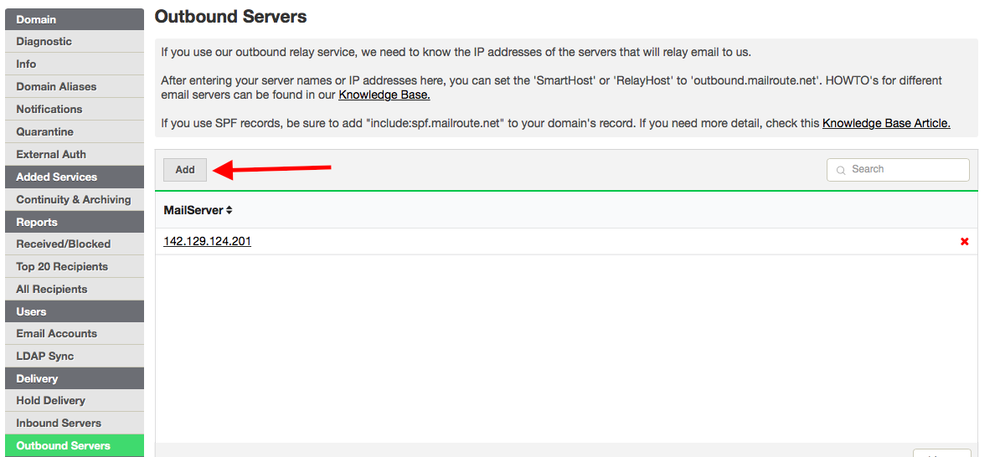
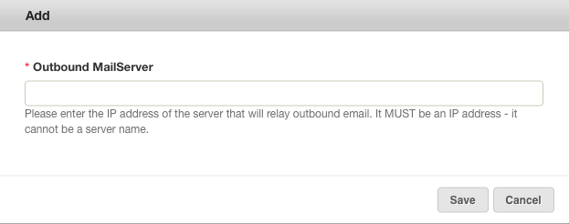

If you're using MailRoute's inbound filtering, you may choose to use the
**MailRoute Outbound Filtering SmartHost/Relay Host Service** (TM. All rights
reserved.)

### Description

With **MailRoute's outbound service** , email from your mailboxes is routed to
our servers for filtering before it is sent off to external mailboxes. This
protects your partners and customers from receiving virus-infected emails, and
makes sure that your mailboxes aren't sending out spam, whether it's
inadvertent or intentional.

If you're tired of finding yourself on blocklists, or having trouble
delivering email to the intended recipients, MailRoute's outbound service can
help. We'll set your mailserver to send all email to us first, and then we
take responsibility for the delivery of the email, lightening the load on your
server, isolating your server from the rest of the internet for added
security, and simplifying administration and maintenance.

We _do **not** offer outbound relay services to bulk email companies_, or for
the purposes of mass mailing, and it is not sold separately from our Inbound
Filtering Services. You must use MailRoute's **Inbound Mail Filtering** to
activate the outbound relay.

### Advantages

  * Isolate your server from the rest of the internet for increased security
  * Simplify your email server configuration and reduce management
  * Improve the deliverability of your email
  * Stop worrying about being added to email blocklists
  * Stop emails sent by viruses or trojans on your mailbox's computers
  * Our custom 'Pen Pals' feature tracks the recipients of your outbound email messages and stores that data away in a temporary table and uses it to dynamically adjust scores for mail relay. This ensures better deliverability for your users

### Requirements

We restrict access for our Outbound service by **IP address**. Your mailserver
must have a **static IP address** in order to use this service.

### Implementation

  1. Under **Delivery** in the menu, select **Outbound Servers**. Enter the **IP addresses** of each of your email servers.

  1. Set the **Smart/RelayHost** setting of your mailserver to **_outbound.mailroute.net._** We have information on how to do this for various email servers such as MS Exchange in our [online knowledgebase](https://support.mailroute.net/hc/en-us/sections/205311868-Configuring-Outbound-Email-Services).

  2. Update your **SPF record**. Add " _ **include:spf.mailroute.net**_ " to your SPF record. If your record looks like this:

If your record looks like this:

    
            "v=spf1 ip4: **192.168.0/27** -all"  ** <** **this IP range is ONLY an example**

**Add** our spf record to it so that it looks like this:

    
            "v=spf1 ip4:192.168.0/27 include:spf.mailroute.net -all"  
      
    If you are using MailRoute for **ALL** of your outbound   
    you only need to use the following;  
      
        "v=spf1 include:spf.mailroute.net ~all"

For more information call 888.485.7726 / email
[support@mailroute.net](mailto:support@mailroute.net).

3\. Set your[ DKIM records](https://support.mailroute.net/hc/en-
us/articles/115009100687-Implementing-DKIM-for-the-MailRoute-Outbound-
SmartHost-Service) ([and ADSP and DMARC](https://support.mailroute.net/hc/en-
us/articles/360062946093-Implementing-DMARC-for-the-MailRoute-Outbound-
SmartHost-Service)) to ensure deliverability of your emails. This is essential
to ensuring your mail gets to the recipient.

[Start a free 30-day trial today.](http://mailroute.net/signup.html)

Contact [sales@mailroute.net](mailto:sales@mailroute.net) or
[support@mailroute.net](mailto:support@mailroute.net) for more information.

888.485.7726

