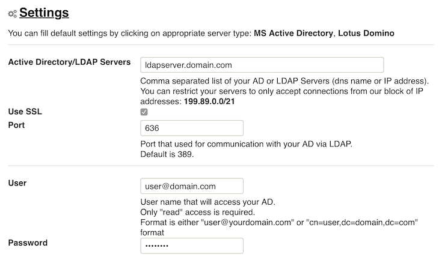
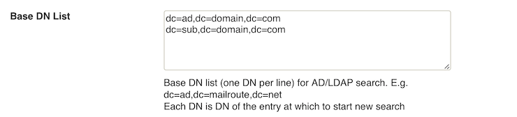
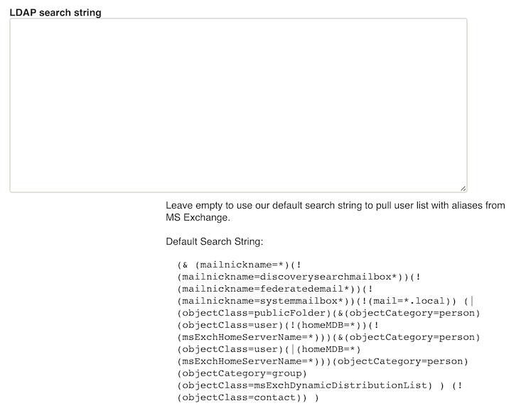
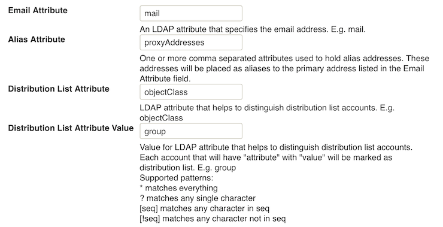
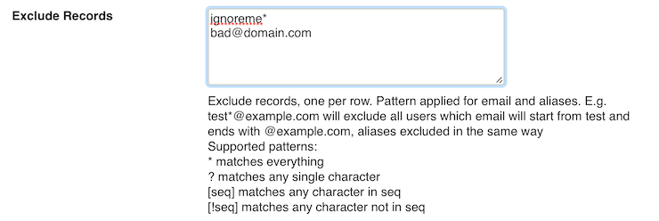
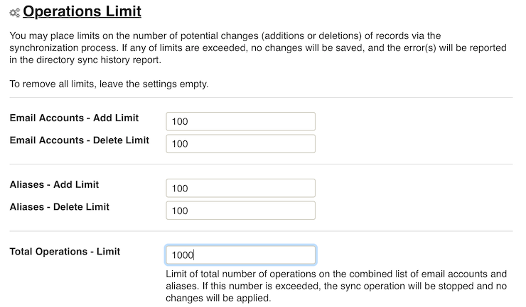
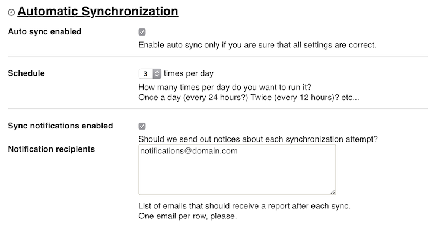

## ActiveDirectory and LDAP Synchronization by MailRoute

MailRoute provides automatic synchronization for Microsoft ActiveDirectory and
many other types of LDAP servers for easy account management.

MailRoute servers can query your AD/LDAP server for lists of valid user
accounts and aliases. Any changes you make to your mailbox lists will be
automatically updated in your MailRoute account.

MailRoute will then recognize mail for those mailboxes, and we'll use this
list to provide an accurate mailbox count for billing purposes.

### Why do I need it?

Your life just got easier! If you haven't been using MailRoute's API to manage
your mailbox lists, then with ActiveDirectory and LDAP sync, you no longer
have to add or delete mailboxes manually in your MailRoute account.

### Manual and Automatic Synchronization

You can setup your servers to sync manually or automatically. Even if you
choose automatically scheduled syncs, MailRoute recommends doing manual tests
of this feature periodically. Or, you can simply do manual syncs whenever you
like.

Our block of addresses is **199.89.0.0/21** , the same IP's you've allowed for
filtering.

### Configure AD/LDAP Sync

  1. Configure your AD/LDAP server to accept connections from our servers. 
    * Create an account on your AD/LDAP server with read-only permissions
    * If necessary, configure your server and/or firewall to accept connections from MailRoute's IP addresses. 

Our block of addresses is **199.89.0.0/21** , the same IP's you've allowed for
filtering.

  2. Login to the MailRoute Control Panel for your domain, and select "LDAP Sync" from the menu at the left of the screen.
  3. Click the **Settings** link to display the form to configure the service

    * **Active Directory/LDAP Servers**

This is a comma separated list of servers to which we should attempt to
connect. They will be tried in order.

_required: yes_  
_default: none_  
_example: ad.domain.com_

    * **Use SSL**

Should our servers connect to your servers using SSL?

_default: off_

    * **Port**

What port should we use to connect to your servers?

The Standard AD/LDAP port is 389. The standard port when using SSL is 636. But
you can use a non-standard port if you wish.

_required: no_  
_default: 389 or 636, depending on SSL setting above_

    * **User**

The username that will be used to connect to the server.

This requires only **READ** access to the server. Indeed, we recommend against
using an account with any level of Write access.

The username may be in either standard AD/LDAP format:

      * username@domain.com
      * cn=user,dc=domain,dc=com

_required: yes_  
_default: none_  
_example: username@domain.com or cn=user,dc=domain,dc=com_

    * **Password**

You can probably guess what this field is for.

_required: yes_  
_default: none_

    * **Base DN**

This is the base DN for your AD or LDAP configuration. It's
typically related to your domain name, but if you support multiple
suborganizations or the like, it may be a bit different. It's going to look
something like

      * dc=testdomain,dc=com

_required: yes_  
_default: none_  
_example: username@domain.com or cn=user,dc=domain,dc=com_

    * **LDAP Search String**

If you leave this blank, we'll use a standard search
string that will retrieve all the mailbox accounts and aliases from the
typical Microsoft Active Directory Server. This is a fairly complex lookup:

`(& (mailnickname= _)(!(mailnickname=discoverysearchmailbox_
))(!(mailnickname=federatedemail _))(!(mailnickname=systemmailbox_ )) (|
(objectClass=publicFolder) (&(objectCategory=person) (objectClass=user)
(!(homeMDB= _)) (!(msExchHomeServerName=_ ))) (&(objectCategory=person)
(objectClass=user) (|(homeMDB= _) (msExchHomeServerName=_ )))
(objectCategory=person) (objectCategory=group)
(objectClass=msExchDynamicDistributionList) ) (!(objectClass=contact)) )  
`

You can change this to something else if necessary, and use the Test
Connection button to see if the server is properly returning results based on
your query.

_required: no_  
_default: none_

    * **Email Attribute**

This is the AD/LDAP Attribute that specifies the email address.

Leave it empty to use the default of **mail**

_required: no_  
_default: 'mail'_

    * **Alias Attribute**

This is the AD/LDAP Attribute that specifies email aliases.

Leave it empty to use the default of **proxyAddresses**

You can list one or more attributes in here. Just separate them with commas.

_required: no_  
_default: 'proxyAddresses'_

    * **Distribution List Attribute**

This is the AD/LDAP Attribute that identifies Distribution Lists.

_required: no_  
_default: none_  
_example: objectClass_

    * **Distribution List Attribute Value**

This is the value of the AD/LDAP Distribution List Attribute that identifies
that an entry is a distribution list.

_required: no_  
_default: none_  
_example: Group_

    * **Exclude Records**  

Sometimes you have entries in your AD/LDAP server and you don't want email
addresses created for them in the MailRoute Control Panel. You can specify
those addresses here.

Enter one address per row.

If you use domain aliases, you may want to use wildcards for the domain part
of the email addressYou can use wildcards:

      * ***** matches everything
      * **?** matches a single character
      * **[seq]** matches any character in seq, such as [a-zA-Z] or [0-9]
      * **[!seq]** matches any character not in seq, such as [!0-9]

_required: no_  
_default: none_  
_example: forgetme[0-9]@domain.com or baduser@*_

    * Save your configuration by clicking the **Save** button

  4. Optional: Click the **Operations Limits** link to display the form to configure optional limits 

You may want to set limits to the numbers of additions or
deletions of email addresses and aliases, or the the total number of
operations that happen in one sync operation.

Leave the values empty if you do not want any limits.

    * **Email Accounts - Add Limit**

Maximum number of email accounts to be added in one sync operation.

_required: no_  
_default: none_  
_example: 100_

    * **Email Accounts - Delete Limit**

Maximum number of email accounts to be deleted in one sync operation.

_required: no_  
_default: none_  
_example: 100_

    * **Aliases - Add Limit**

Maximum number of aliases to be added in one sync operation.

_required: no_  
_default: none_  
_example: 100_

    * **Aliases - Add Limit**

Maximum number of aliases to be added in one sync operation.

_required: no_  
_default: none_  
_example: 100_

    * **Total Operations**

This is a limit on the combined number of operations on email accounts and on
aliases.

_required: no_  
_default: none_  
_example: 1000_

    * Save your configuration by clicking the **Save** button

  5. Optional: Click the **Automatic Synchronization** link to display the form to configure Automatic Synchronization 

You can have our AD/LDAP sync process run automatically from
1 to 4 times per day.

    * Auto Sync Enabled 

Once you've tested your AD/LDAP Sync via the manual sync process and are
comfortable that everything is working to your satisfaction, you can enable
Automatic Synchronization.

_required: no_  
_default: off_

    * Schedule 

Choose from 1 to 4 times per day.

_required: no_  
_default: 1_

    * Sync Notifications Enabled 

You may have sync reports emailed to one or more email addresses after each
sync process.

_required: no_  
_default: none_

    * Notification Recipients 

A comma separated list of email addresses to receive the Sync Notifications

_required: no_  
_default: none_  
_example: user@domain.com_

    * Save your configuration by clicking the **Save** button

  6. Test your configuration and perform manual AD/LDAP Sync 

Test your connection settings and perform manual AD/LDAP syncs

    * **Test Connection**

This will attempt to connect to your AD/LDAP server and retrieve a few records
based on your connection settings.

It's a quick way to make sure that your login credentials are correct, and to
see how the search string and base dn settings are working.

    * **Manual Sync**

This will perform a full sync operation. If you've specified notification
email addresses, they will be notified the results of the process.

You can also view your sync history below

[Start a free 30-day trial today.](http://mailroute.net/signup.html)

Contact [sales@mailroute.net](mailto:sales@mailroute.net) or
[support@mailroute.net](mailto:support@mailroute.net) for more information.

[888.485.7726](tel:888.485.7726)

