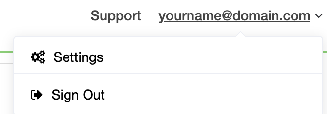
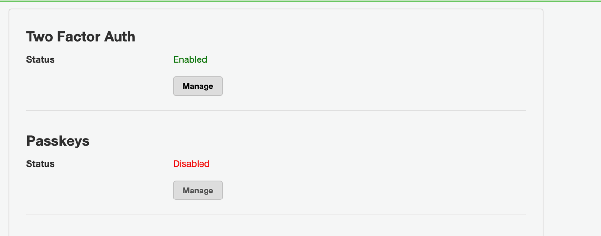
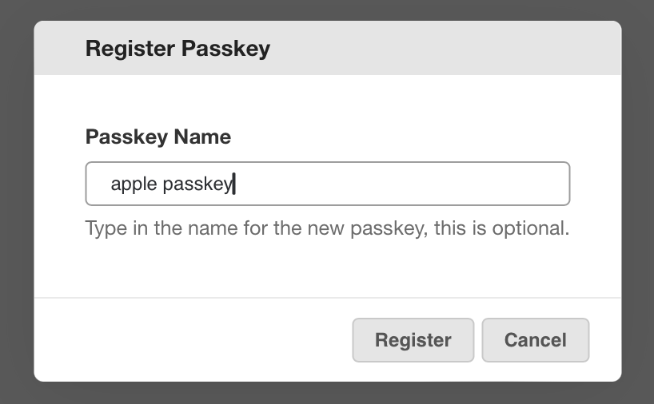
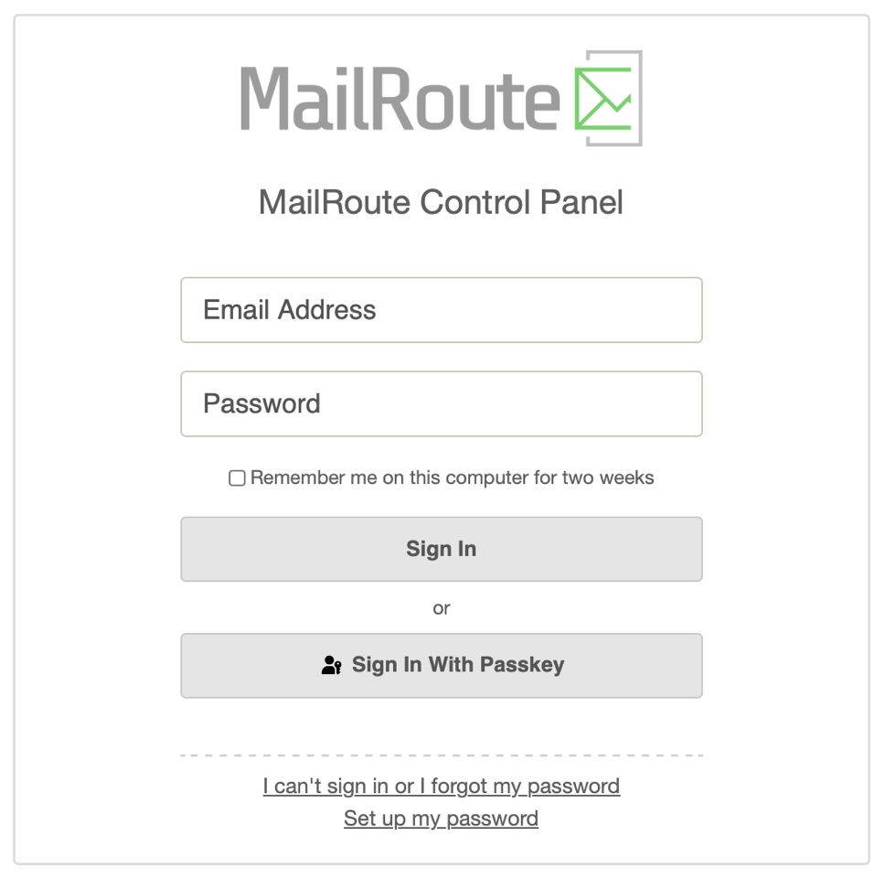

MailRoute Control Panel Passkey Support

What are Passkeys?

Passkeys are a new, more secure alternative to passwords designed to enhance
user authentication on websites and apps. Unlike traditional passwords,
passkeys do not require users to remember or enter any information. Instead,
they use cryptographic techniques to verify identity, leveraging devices that
users already have, like smartphones or laptops. When a user attempts to log
in, the service prompts them to authenticate with their device, which might
involve biometrics (such as a fingerprint or facial recognition) or a device
PIN. This process not only simplifies the login experience but also
significantly reduces the risk of phishing and password theft, as passkeys are
unique to each site and cannot be reused across different services.

The adoption of passkeys aligns with global efforts to enhance digital
security. By storing passkeys securely on a user's device and employing local
authentication methods, passkeys ensure that users' credentials are never
exposed during transmission or server breaches. This advancement supports a
more seamless and secure internet experience, moving us closer to a password-
free future.

How do I use MailRoute Passkeys?

Login to [https://admin.mailroute.net](https://admin.mailroute.net/) as usual.
Go to your **Settings** page via the menu under your **name** on the top-right
corner

****

Under **Passkeys,** choose **Manage:**

****

****

Then choose **Register Passkey:**

Give your Passkey a name (for example "Apple" if it's on an Apple device, etc)
and click **Register:**

Depending on your device (Apple laptop with Touch-ID, iPhone with Face-ID,
various biometric devices for other devices such as android phones, etc),
you'll be presented with a dialog to activate your Passkey.

You've created your Passkey! You can add more than one, if you access the
Control Panel from different types of devices.

Next time you login to
[https://admin.mailroute.net](https://admin.mailroute.net/), after entering
your email address, you're given an option to "Sign in with Passkey"

No additional Multi-Factor Authentication is required, since that's all
incorporated into Passkeys.

