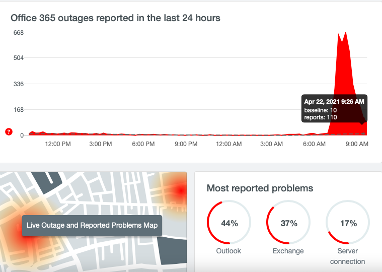

We have reports that that are issues with Exchange and Office 365 mailservers
currently. We will post any updates as we receive new information.

<https://www.bleepingcomputer.com/news/microsoft/exchange-online-down-
microsoft-365-outage-affects-email-delivery>

Microsoft has tweeted the following for o365
[here](https://twitter.com/MSFT365Status?ref_src=twsrc%5Egoogle%7Ctwcamp%5Eserp%7Ctwgr%5Eauthor)

https://downdetector.com/status/office-365/

